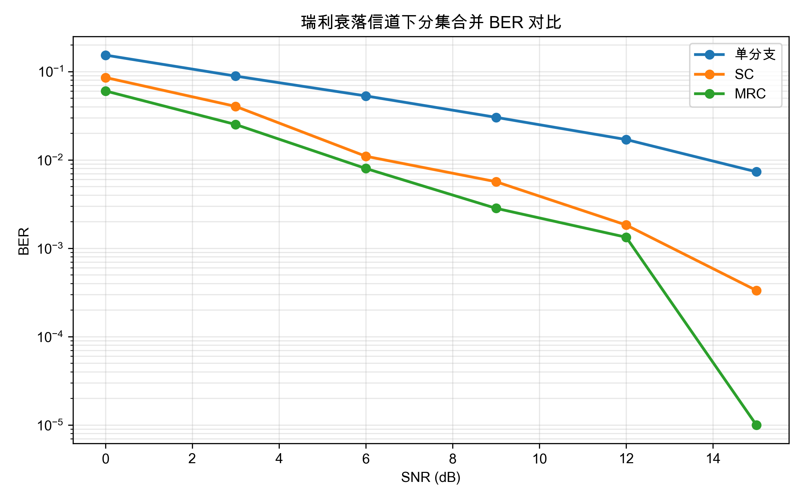
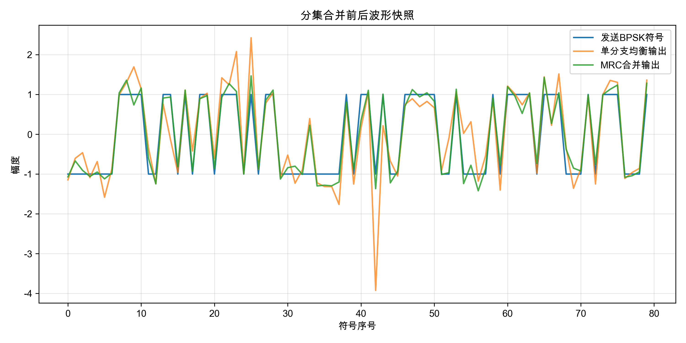
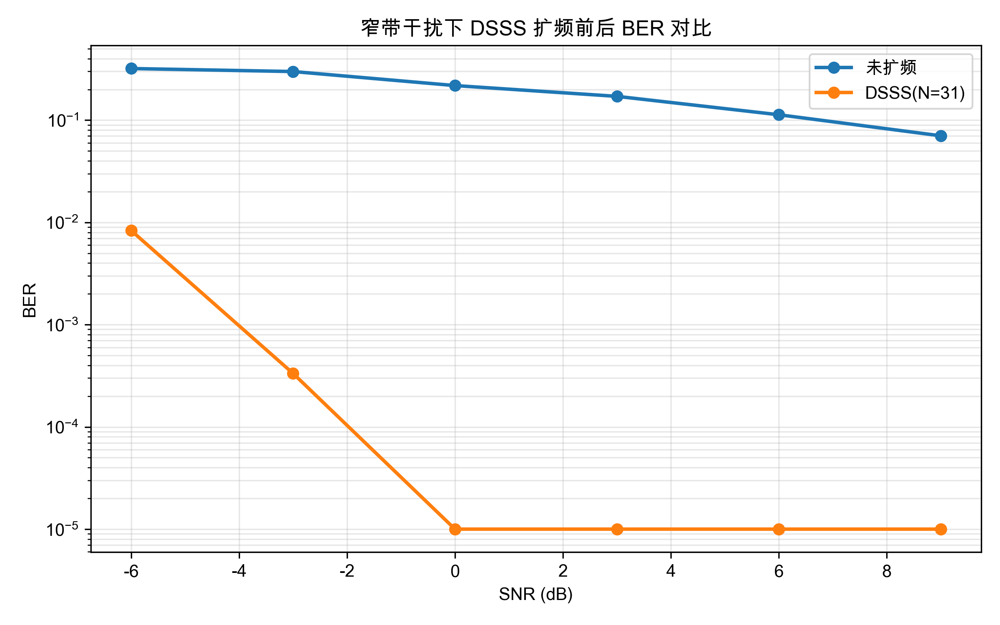
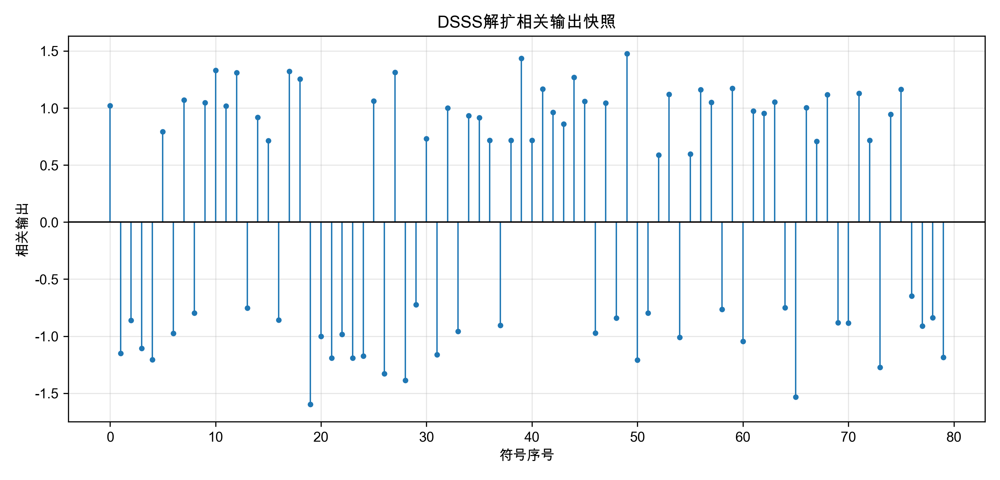

# 无线通信技术实验报告：分集与扩频通信

## 1. 实验目的

本实验围绕无线通信中的分集技术和扩频通信展开，目标是通过代码实现和结果分析理解两类典型抗衰落、抗干扰方法的基本机制。首先，在分集合并部分，需要在独立瑞利平坦衰落分支上实现选择合并（SC）、最大比合并（MRC），并进一步完成等增益合并（EGC）选做内容，从误码率曲线中观察多分支接收带来的分集增益。其次，在直接序列扩频（DSSS）部分，需要实现 m 序列生成、扩频、解扩、处理增益计算，以及同步偏移搜索选做功能，并观察在窄带干扰和噪声共同存在时扩频通信的误码率表现。除此之外，本实验还要求熟悉 Python 仿真、自动评分脚本和结果图生成流程，形成从理论、实现到验证的完整实验能力。

## 2. 实验原理

### 2.1 分集合并

无线信道中的多径传播会造成接收信号包络随时间快速波动，尤其在瑞利衰落模型下，信号幅度可能在某些时刻跌落到很低水平，这种现象称为深衰落。深衰落会导致接收信噪比显著下降，进而造成误码率迅速升高。为了降低单一路径深衰落带来的影响，可以在空间、时间或频率上引入多个相互独立或低相关的接收分支，再对这些分支进行合并，这就是分集技术的核心思想。

选择合并（Selection Combining, SC）的原则是，对于每个接收符号，仅选取瞬时信道增益最大的那个分支，也就是选择 `|h|^2` 最大的支路，并对该分支做均衡恢复。该方法实现简单，运算量低，但没有充分利用其他分支中的能量。

最大比合并（Maximal Ratio Combining, MRC）会对所有分支同时利用，并使用信道系数的共轭作为加权系数。其数学形式为：

`y = sum(conj(h_i) * r_i) / sum(|h_i|^2)`

其中 `r_i` 是第 `i` 个分支的接收信号，`h_i` 是对应信道系数。乘以共轭相当于相位校正，而按 `|h_i|` 大小进行加权则能够让信道质量更好的分支贡献更大，因此在理论上 MRC 是同类线性合并方法中的最优方案之一。

等增益合并（Equal Gain Combining, EGC）介于 SC 和 MRC 之间，只做相位校正，不按幅度大小加权，既能利用所有分支，又比 MRC 略简单。本实验将其作为附加实现，用于说明不同合并策略之间的取舍。

### 2.2 扩频通信

直接序列扩频（DSSS）的基本思想是，用一个高速伪随机码序列对低速信息符号进行扩展，使每个原始比特被映射成多个码片。发送前先将二进制比特做 BPSK 映射，即 `0 -> +1`、`1 -> -1`，再让每个符号乘以完整 PN 序列。这样一来，发射信号的带宽被扩大，而单位频带上的功率谱密度下降。

接收端使用与发送端相同的 PN 序列进行相关解扩。由于目标信号与本地 PN 序列同步，其相关输出会重新集中并恢复到较大的判决值；而与 PN 序列不同步的窄带干扰和宽带噪声在相关累加后不能同相叠加，因此会被平均和摊薄，这就是 DSSS 抗干扰能力的来源。

m 序列是一类常用伪随机序列，由线性反馈移位寄存器（LFSR）生成。对长度为 `m` 的寄存器，若反馈多项式选择合适，则可以得到周期为 `2^m - 1` 的最大长度序列。实验中采用双极性表示形式，寄存器输出比特 `0` 映射为 `+1`，输出比特 `1` 映射为 `-1`，便于直接参与 BPSK 扩频和相关运算。

扩频系统的处理增益定义为：

`G_p = 10 * log10(N)`

其中 `N` 为扩频因子，也就是每个信息比特对应的码片数。扩频因子越大，理论上的抗干扰能力越强，但代价是占用更宽的频谱资源。

## 3. 实验环境

- 操作系统环境：macOS
- Python 版本：项目要求为 Python 3.9 及以上
- 主要依赖：NumPy、Matplotlib、pytest
- 实验代码位置：`src/part1_diversity.py` 与 `src/part2_spread_spectrum.py`
- 自动评分入口：`grading/calculate_grade.py`
- AI 助手使用情况：本实验使用了 AI 助手协助阅读实验要求、分析评分脚本、补全核心函数、生成实验报告文字并执行本地测试，但所有核心公式、关键实现逻辑和结果分析都经过人工检查与理解后再保留。

## 4. 实验方法

### 4.1 Part 1：分集合并

分集合并部分的实验流程如下：

1. 随机生成二进制信息比特。
2. 将比特做 BPSK 调制，得到取值为 `+1/-1` 的发送符号。
3. 通过独立瑞利平坦衰落信道生成多个接收分支，并加入 AWGN 噪声。
4. 对单分支接收结果直接做均衡和判决，作为无分集基准。
5. 对多分支接收结果分别使用 SC、MRC 和选做的 EGC 进行合并。
6. 将合并后的符号做硬判决，统计 BER。
7. 在多个 SNR 点重复上述流程，绘制 BER 曲线并观察性能差异。

实现时，SC 的关键在于逐符号选择 `|h|^2` 最大的分支；MRC 的关键在于使用信道共轭进行相位补偿并按分支质量加权；EGC 则只使用相位校正，将每个分支旋转到统一相位后等权合并。通过这些对比，可以直观看到“是否利用全部分支能量”和“是否按信道质量加权”对误码性能的影响。

### 4.2 Part 2：DSSS 扩频通信

扩频部分的实验流程如下：

1. 设定 LFSR 初始状态和反馈抽头，生成双极性 m 序列作为 PN 码。
2. 生成随机信息比特，并做 BPSK 映射。
3. 将每个 BPSK 符号与完整 PN 序列相乘，形成扩频后的码片流。
4. 在信道中同时叠加窄带正弦干扰和 AWGN。
5. 接收端把码片流按扩频因子重整为矩阵，逐符号与 PN 序列做相关。
6. 利用相关输出的符号进行硬判决，得到恢复比特。
7. 在多个 SNR 点上比较未扩频系统和 DSSS 系统的 BER。
8. 进一步实现同步偏移搜索，在接收端存在起始偏移时选择平均相关绝对值最大的对齐位置。

其中，m 序列生成严格遵循实验文档中的约定：输出寄存器最右端，移位方向为整体右移，反馈比特插入最左端，抽头位置按从左到右的 1-based 编号理解。这样实现后，生成结果可以与参考序列完全一致。同步偏移搜索虽然不在基础测试项中，但它体现了 DSSS 接收机在实际系统中对同步问题的处理思路，因此作为附加项实现具有工程意义。

## 5. 实验结果

运行实验脚本后生成了四张结果图，分别对应分集合并 BER 曲线、分集波形快照、DSSS BER 曲线和解扩相关输出快照。

从图中可以观察到，在相同 SNR 下，采用分集合并后的 BER 明显优于单分支接收，且 MRC 曲线通常最低。另一方面，在窄带干扰存在时，未扩频系统的误码率下降较慢，而 DSSS 系统在解扩之后具有更好的抗干扰能力，随着 SNR 提升 BER 改善更加明显。相关输出快照中，大部分符号的相关值会围绕正负两个稳定区域分布，说明扩频信号经过解扩后仍能形成有效判决裕量。

## 6. 结果分析

### 6.1 瑞利衰落为何会造成深衰落

瑞利衰落来源于大量多径分量在接收端相互叠加。由于这些分量的相位随机变化，在某些时刻会发生近似完全相消，使接收幅度突然变得很小。因为数字通信的误码性能与瞬时信噪比直接相关，所以一旦进入深衰落，接收判决会变得极不可靠，误码率随之升高。

### 6.2 SC 与 MRC 的思想差异

SC 的核心思想是“只挑最好的那一路”，它避免了差信道分支对结果的影响，实现简单，适合复杂度敏感场景。MRC 的思想则是“把所有分支都利用起来，并且让好的分支权重大、差的分支权重小”，因此它能更充分地提取多分支中的有效信号能量。两者的根本差别在于是否只做离散选择，还是做连续加权合并。

### 6.3 为什么 MRC 往往优于 SC

MRC 优于 SC 的原因在于它不浪费任何一个可用分支。当一个分支较强、另一个分支较弱时，SC 只能保留强分支；而 MRC 既保留强分支，也能从弱分支中提取部分有用信息，同时通过共轭加权完成相位对齐并按增益做最优组合。因此在统计意义上，MRC 的输出信噪比通常更高，BER 也更低。

### 6.4 DSSS 处理增益与扩频因子的关系

处理增益由 `10*log10(N)` 给出，其中 `N` 是扩频因子。随着 `N` 增大，单个信息比特被扩展为更多码片，接收端在解扩时相当于对更多芯片进行相干累加，因此目标信号能量恢复更集中，而随机噪声与非同步干扰的相对影响被削弱。处理增益越大，系统理论上的抗干扰能力越强，但同时也意味着更大的带宽开销。

### 6.5 窄带干扰经过解扩后为何会被摊薄

窄带干扰本身并不与本地 PN 码同步，所以在相关解扩过程中，它与 PN 码片的乘积在一个符号周期内会呈现正负交替、彼此抵消的趋势。相反，目标 DSSS 信号因为是用同一 PN 序列扩展得到的，解扩时会同向累加。因此，解扩过程对期望信号表现为压缩恢复，对非同步干扰表现为扩散平均，结果就是干扰能量被摊薄，目标信号更容易判决。

### 6.6 BER 曲线是否符合理论预期

本实验中的 BER 曲线整体符合理论预期。对于分集部分，单分支性能最差，SC 有明显改善，MRC 通常优于 SC，这与分集理论一致。对于 DSSS 部分，在窄带干扰背景下，扩频系统的 BER 相比未扩频系统更低，并且随着 SNR 提高改善更明显，说明解扩确实带来了处理增益和抗干扰收益。个别 SNR 点若出现轻微波动，主要是有限长度随机仿真和随机噪声种子造成的统计误差。

## 7. 实验心得

通过这次实验，我对“抗衰落”和“抗干扰”这两个无线通信中的核心问题有了更具体的理解。过去只是在公式层面知道 SC、MRC 和 DSSS 的概念，而通过亲自实现后，我更清楚地看到了这些方法背后的工程含义。例如，MRC 并不是简单把各分支相加，而是先利用共轭进行相位校正，再依据分支强弱做加权；DSSS 也不仅仅是把信号“拉长”，而是通过发送端扩频和接收端解扩配合，在相关域中重新集中目标信号能量。

此外，这次实验也让我认识到自动评分脚本对于实验开发过程的重要性。只要先读清楚测试项、图像要求、报告检查规则和代码质量标准，就能更有针对性地实现功能，减少无效修改。AI 助手在这方面提供了帮助，例如快速梳理评分点、协助生成初稿和跑本地验证，但真正决定结果是否可靠的仍然是对公式、代码和输出的人工复核。总体来看，这次实验把理论知识、编程实现和结果分析串联在了一起，收获比较完整。

## 8. 参考资料

- 《无线通信技术》课程课件，第 8 章：分集
- 《无线通信技术》课程课件，第 9 章：扩展频谱通信
- 项目文档 [README.md](README.md)
- 理论文档 [docs/theory_diversity.md](docs/theory_diversity.md)
- 理论文档 [docs/theory_spread_spectrum.md](docs/theory_spread_spectrum.md)
